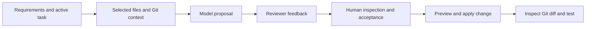

# AI Development Team / AI Team Coordinator

**A development workbench coordinating three AI providers with project context and human review.**  
Personal prototype by Tom Magnusson · Next.js · React · TypeScript · OpenAI · Gemini · xAI

The project brings tasks, relevant workspace files, model responses, reviewer feedback and proposed changes into one local workflow.

## Workflow

OpenAI handles architecture/development and QA-oriented prompts, Gemini provides review, and Grok supplies research-oriented suggestions. These are application roles, not a guarantee that any provider is inherently best at that task. Research-oriented prompting is not the same as a independently verified web-research pipeline.

## Engineering focus

**Context before generation.** Requirements, the active task and selected files are assembled around a specific development problem.

**Review and traceability.** Feedback and decisions are retained with project state rather than scattered between unrelated conversations.

**Controlled changes.** The uploaded 0.4.2 prototype adds Git-based dry-run/apply operations and explicit commit/push actions. Human acceptance is a workflow control, not authentication or a guarantee of correctness. The older development-repository snapshot, 0.2.8, uses a local diff parser instead; these versions should not be confused.

## Included code sample

[`openai-route.ts`](openai-route.ts) is the server-side OpenAI route from the supplied prototype. It demonstrates environment-based credentials, input checks, a provider request, output extraction and error propagation. Keys are read from the environment and are not included in the sample.

This is a **Next.js route excerpt**, not a standalone executable or the complete workbench. It requires the corresponding Next.js application to run. No live provider call is part of the portfolio's test command.

## Boundaries

The application is local-first: browser `localStorage` holds project state and server routes access the local workspace. Selected context is sent to external providers. It is not a hardened sandbox or multi-user service; confidential files should not be supplied without permission. Generated code and resulting diffs still need human review and the target project's own tests.

This public case study describes the uploaded 0.4.2 prototype while the full development repositories remain private. It does not claim autonomous software delivery or production readiness.

[Back to portfolio](../../README.md)
