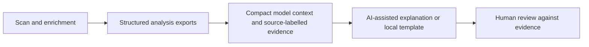

# EvidenceLayer

**Data investigation first; AI explanations built around evidence.**  
Personal project by Tom Magnusson · Node.js · JavaScript/TypeScript · blockchain RPC APIs · optional OpenAI reporting

EvidenceLayer explores how token activity, balances and transfer relationships can be turned into inspectable reports. The wider application collects and enriches data, produces structured outputs and uses selected evidence as context for AI-assisted analysis.

## Workflow



The development repository has evolved into a Next.js frontend with workspace and chain/DEX configuration. This public sample deliberately isolates a small part of the earlier NLC v30 prototype rather than claiming to contain the full current system.

## Decision worth examining

**Tracked-wallet share and total-supply share are not interchangeable.** The evidence builder keeps these concepts distinct and labels the source file behind each statement. Missing percentage values become `n/a` instead of an invented percentage.

The AI component consumes prepared context; it does not replace the underlying calculations. Source labels help inspection but do not automatically fact-check a model response. In the original module, even heuristic classifications can appear in an evidence object's `fact` field: that field name must not be interpreted as proving the classification is true.

## Included source

- [`evidence-builder.mjs`](evidence-builder.mjs): formatting helpers and `buildEvidence` extracted unchanged from `src/aiAnalystCore.js` in the supplied NLC v30 archive.
- [`tests/evidence-builder.test.mjs`](tests/evidence-builder.test.mjs): four synthetic regression checks added specifically for this public extraction.

From the portfolio root:

```bash
node --test projects/evidencelayer/tests/evidence-builder.test.mjs
```

The sample needs no dependencies, RPC endpoint, API key or real wallet dataset. It tests evidence packaging only, not blockchain accuracy or model quality.

## Scope and limitations

The full application includes scanning, enrichment, dashboards and optional AI reports. None of those external services or complete workflows are launched by this directory. It contains no private wallet labels, report exports, credentials or real customer data.

Transfer paths and rule-based classifications are investigation leads, not proof of identity, ownership, coordination or wrongdoing. AI-generated conclusions need review against source evidence. This is not an investment, legal or compliance-advice product.

Developed through AI-assisted implementation, hands-on debugging and iteration.

[Back to portfolio](../../README.md)
