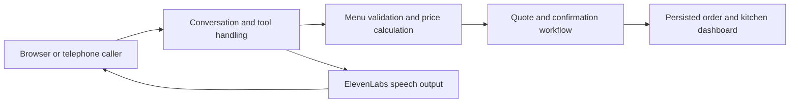

# Swedish AI voice receptionist

**Conversational ordering with server-controlled business rules.**  
Personal prototype by Tom Magnusson · Node.js · OpenAI Realtime · ElevenLabs · Twilio

The application explores a practical question: can a caller describe a takeaway order naturally while the kitchen receives a structured, priced order rather than a transcript?

## Full prototype workflow



The full prototype connects OpenAI Realtime to a Node.js backend, with ElevenLabs speech output and a Twilio telephone path. It includes a kitchen dashboard, voice selection and audio-interruption handling. This public directory publishes the deterministic order-engine component, not the entire application or a hosted telephone service.

## Decision worth examining

**The model does not own the menu or calculate the authoritative price.** The order engine resolves requested products and modifications against configured menu data, rejects unsupported requests and calculates the total in ordinary code. Swedish ingredient aliases are mapped to canonical values so the kitchen receives consistent instructions.

The wider application adds expiring quotes and a confirmation flag before creating an order. A model-supplied flag is not independent proof that a caller consented; conversation behaviour still needs testing.

## Included source

- [`lib-order-engine.mjs`](lib-order-engine.mjs): unchanged order-engine module extracted from the supplied pizzeria prototype.
- [`data/menu.json`](data/menu.json): reduced demonstration fixture with three products and four extras. It contains no restaurant contact details or order history.
- [`tests/order-engine.test.mjs`](tests/order-engine.test.mjs): eight original behavioural tests, with customer name/phone inputs changed to explicit synthetic examples.

From the portfolio root:

```bash
node --test projects/pizzeria-voice-agent/tests/order-engine.test.mjs
```

No API key, installation or live call is required. The tests cover calculated prices, unknown products, invalid modifications, Swedish aliases and separate variants of an order.

## Scope and limitations

This sample does not include the server, live AI calls, telephone configuration, persisted orders or the kitchen UI. Passing the sample tests does not validate real-call accuracy, allergy handling or production availability. The full prototype still requires operational hardening and controlled pilot testing before customer deployment.

Built using AI-assisted development with practical testing and debugging. The example is intended to make one integration decision inspectable rather than present a prototype as a production platform.

[Back to portfolio](../../README.md)
